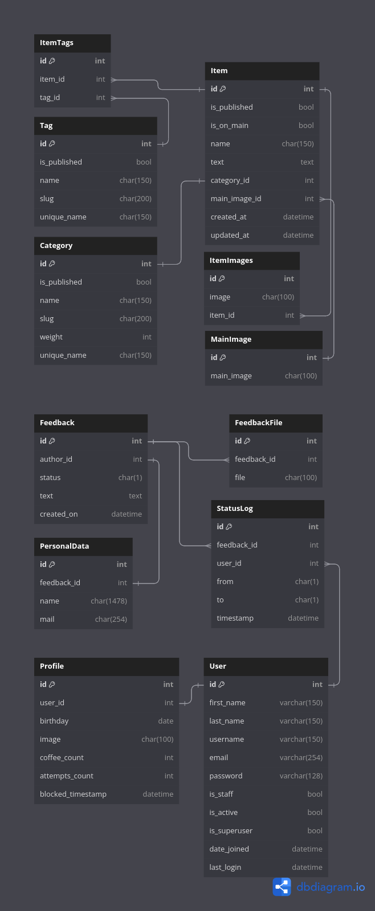

# SaaShop

[](https://gitlab.crja72.ru/django_2023/students/201154-itq-dev-course-967/-/pipelines)

## Cloning project

Run this git command

```cmd
> git clone git@gitlab.crja72.ru:django_2023/students/201154-itq-dev-course-967.git
```

## Creating translations

### Creating .po file for ru

```cmd
> django-admin makemessages -l ru
```

### Compiling translations

```cmd
> django-admin compilemessages
```

## ER Diagram



## Dev setup

### Linux

#### Creating virtual enviroment

```cmd
> pip install virtualenv
> virtualenv virtualenv_name
> source virtualenv_name/bin/activate
```

#### Setup .env file

```cmd
> cp .env.template .env
```

And change .env for your needs

### Windows

#### Creating virtual enviroment

```cmd
> python -m venv venv
> venv\bin\activate
```

#### Setup .env file

```cmd
> copy .env.template .env
```

And change .env for your needs

### Installing requirements

Prod requirements installation

```cmd
> pip install -r requirements/prod.txt
```

Dev requirements installation

```cmd
> pip install -r requirements/dev.txt
```

Test requirements installation

```cmd
> pip install -r requirements/test.txt
```

## Preparing database

### Applying migrations

```cmd
> python manage.py migrate
```

### Loading fixtures

```cmd
> python manage.py loaddata fixtures/data.json
```

### Using bult in command

```cmd
> python manage.py initdata
```

## Collecting static

Run this command:

```cmd
> python manage.py collectstatic
```

## Dev run

```cmd
> python manage.py runserver
```

## Prod run

```cmd
> gunicorn saashop.wsgi
```
